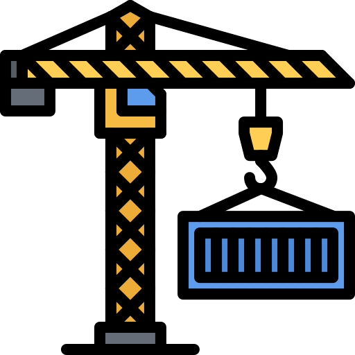

<div align="center">
  

  <h3>Infrastructure as Code (IaC) by Bryan J.</h3>

  <p>A comprehensive set of tools and configurations for automating tasks across various environments.</p>
  <p>
    <a href="https://chkpwd.com"><strong>Blog »</strong></a>
  </p>
  <p>
    <a href="https://github.com/chkpwd/iac/tree/main/kubernetes/apps">Kubernetes Deployments</a>
    &middot;
    <a href="https://github.com/chkpwd/iac/tree/main/ansible/roles">Ansible Roles</a>
    &middot;
    <a href="https://github.com/chkpwd/iac/tree/main/terraform/_modules">Terraform Modules</a>
  </p>
</div>

## Overview

This repository provides a set of tools and configurations for automating tasks across environments. It includes Ansible playbooks and roles, Docker configurations, Kubernetes manifests, Terraform modules, and Packer scripts. Secrets are managed through various methods, most notably **Bitwarden Secrets Manager**. The project is designed with flexibility in mind, allowing users to choose their tools based on specific requirements.

## About The Lab

### Kubernetes

[](https://kubernetes.io/)&nbsp;
[](https://github.com/kashalls/kromgo)&nbsp;
[](https://github.com/kashalls/kromgo)&nbsp;
[](https://github.com/kashalls/kromgo)&nbsp;
[](https://github.com/kashalls/kromgo)&nbsp;
[](https://github.com/kashalls/kromgo)&nbsp;
[](https://github.com/kashalls/kromgo)&nbsp;

#### Core Components

- [Cilium](https://github.com/cilium/cilium): Internal Kubernetes networking plugin.
- [Cert-manager](https://cert-manager.io/docs/): Creates SSL certificates for services in the cluster.
- [External DNS](https://github.com/kubernetes-sigs/external-dns): Syncs DNS records from Kubernetes ingresses to a DNS provider.
- [External Secrets](https://github.com/external-secrets/external-secrets/): Manages Kubernetes secrets using [Bitwarden](https://bitwarden.com/).
- [Ingress NGINX](https://github.com/kubernetes/ingress-nginx/): NGINX-based ingress controller for Kubernetes.
- [Longhorn](https://longhorn.io/): Cloud-native distributed block storage for Kubernetes.
- [Tofu Controller](https://github.com/flux-iac/tofu-controller): Runs Terraform from within a Kubernetes cluster.

### Terraform

```bash
❯ tree -L1 terraform
terraform
├── _modules
├── _templates
├── authentik
├── aws
[...]
```

#### Core Components
##### bws-cache
Securely retrieves secrets into the Terraform state by making API requests to a secrets management service (like Bitwarden) using an access token. By leveraging the [bws-cache](https://github.com/RippleFCL/bws-cache), it ensures sensitive information is dynamically fetched and securely passed into the Terraform state without hardcoding secrets, minimizing exposure risks.

<details>
  <summary>Example</summary>

  ```python
  [...]
  for key in key_name:
    bws_response = requests.get(
        f"http://mgmt-srv-01:5000/key/{key}",
        headers={"Authorization": f"Bearer {access_token}"},
        timeout=10,
    ).json()

    logging.debug(bws_response)

    try:
        results.append(bws_response['value'])
    except KeyError as exc:
        raise InvalidToken(
            "Token is invalid or does not have permissions to read value"
        ) from exc
  [...]
  ```
  ```
  resource "radarr_download_client_sabnzbd" "sabnzbd" {
    enable         = true
    priority       = 1
    name           = "sabnzbd"
    host           = "sabnzbd.${var.cluster_media_domain}"
    url_base       = "/"
    port           = var.ports["sabnzbd"]
    movie_category = "movies"
    api_key        = data.external.bws_lookup.result["infra-media-secrets_sabnzbd_api_key"]
  }
  ```
</details>

### Ansible
#### Core Components
N/A

## Equipment

<details open>
<summary>Kubernetes</summary>

| Name      | Device       | CPU      | OS Disk  | Data Disk | RAM  | OS     | Purpose              |
|-----------|--------------|----------|----------|-----------|------|--------|----------------------|
| ct-k3s-01 | Lenovo M710q | i5-6500T | 64GB SSD | 1TB NVME  | 32GB | Kairos | control-plane/worker |
| ct-k3s-02 | Lenovo M710q | i5-6500T | 64GB SSD | 1TB NVME  | 32GB | Kairos | control-plane/worker |
| ct-k3s-03 | Lenovo M710q | i5-6500T | 64GB SSD | 1TB NVME  | 32GB | Kairos | control-plane/worker |
</details>

<details>
<summary>Servers</summary>

| Name     | Device        | CPU        | OS Disk    | Data Disk     | RAM   | OS           | Purpose        |
|----------|---------------|------------|------------|---------------|-------|--------------|----------------|
| WhiteBox | Custom        | TR 2970W   | 128GB      | 6TB           | 128GB | Proxmox      | VM/Containers  |
| Synology | RS819         | -          | -          | 4x4TB SHR     | -     | DSM 7        | Storage        |
| mgmt-pi  | Raspberry Pi4 | Cortex A72 | 64GB SSD   | -             | 8GB   | Debian 12    | Misc Software  |
</details>

<details>
<summary>Network</summary>

| Device             | Purpose          |
|--------------------|------------------|
| Dell 7040          | Network - Router |
| TL-SG1016PE        | Network - Switch |
</details>

<p align="right">(<a href="#readme-top">back to top</a>)</p>

## Roadmap

- Finish README
