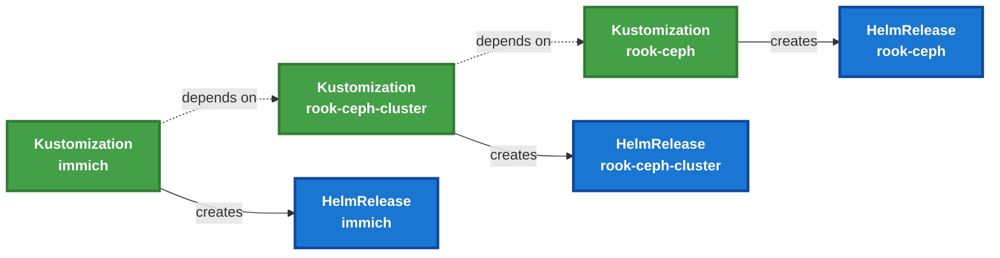
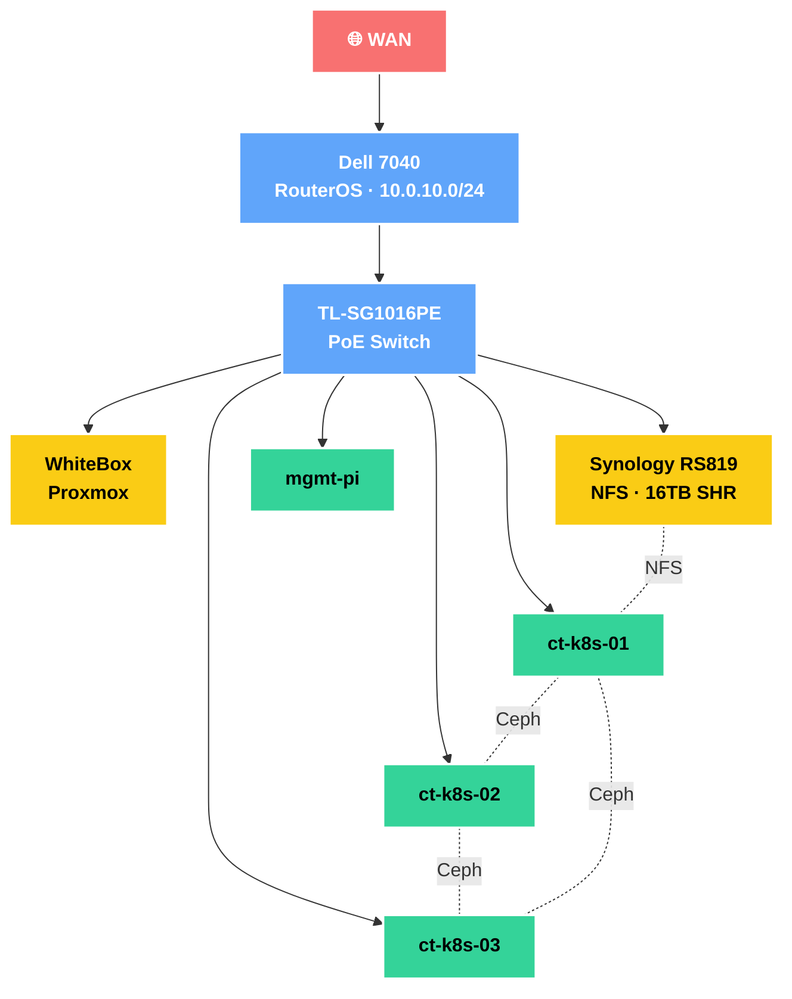

<div align="center">

<a name="readme-top"></a>


<h1>Infrastructure as Code</h1>

<p><em>My homelab, managed end to end with Talos, Flux, Terraform, Ansible, and Renovate.</em></p>

<p>
  <a href="https://chkpwd.com"><strong>Blog »</strong></a>
</p>

<p>
  <a href="https://github.com/chkpwd/iac/tree/main/kubernetes/apps">Kubernetes Apps</a>
  &middot;
  <a href="https://github.com/chkpwd/iac/tree/main/terraform">Terraform</a>
  &middot;
  <a href="https://github.com/chkpwd/iac/tree/main/ansible/roles">Ansible Roles</a>
  &middot;
  <a href="https://github.com/chkpwd/iac/tree/main/packer">Packer</a>
</p>

<p>
  <a href="https://kubernetes.io/"></a>&nbsp;
  <a href="https://www.talos.dev/"></a>&nbsp;
  <a href="https://fluxcd.io/"></a>&nbsp;
  <a href="LICENSE"></a>
</p>

<p>
  &nbsp;
  &nbsp;
  &nbsp;
  &nbsp;
  &nbsp;
  
</p>

</div>

---

<details>
<summary><strong>Table of Contents</strong></summary>

- [Overview](#overview)
- [Repository Layout](#repository-layout)
- [The Cluster](#the-cluster)
  - [How GitOps Works Here](#how-gitops-works-here)
  - [Core Infrastructure](#core-infrastructure)
  - [Applications](#applications)
- [Terraform](#terraform)
- [Ansible](#ansible)
- [Packer](#packer)
- [Hardware](#hardware)
  - [Topology](#topology)
- [Tooling &amp; Automation](#tooling--automation)
- [License](#license)

</details>

## Overview

This is the whole homelab in one repo. Everything from the OS on the bare metal, up
through the Kubernetes cluster, down to the apps and the network config, is defined as
code and applied automatically.

I don't configure anything by hand. Changes go in through pull requests,
[Renovate](https://github.com/renovatebot/renovate) bumps dependencies, and
[Flux](https://fluxcd.io/) keeps the cluster matching whatever is in Git.

**Core principles**

- **GitOps first.** Git is the source of truth and Flux reconciles the difference.
- **Immutable base.** The cluster runs on [Talos Linux](https://www.talos.dev/), an API-driven OS with no shell.
- **Declarative everything.** Kubernetes, cloud, network, and VM templates all live as code.
- **Automated maintenance.** Renovate and GitHub Actions handle updates, linting, and drift detection.
- **Secrets stay out of Git.** SOPS + age for Kubernetes, Bitwarden Secrets Manager for Terraform.

**What's automated**

|     | Capability                                            |
| --- | ----------------------------------------------------- |
| ✅  | Immutable, declarative bare-metal OS (Talos)          |
| ✅  | GitOps-driven application delivery (Flux)             |
| ✅  | Automatic dependency updates with approval (Renovate) |
| ✅  | Automated TLS certificates & DNS records              |
| ✅  | Distributed block storage with scheduled PVC backups  |
| ✅  | Metrics, dashboards & alerting                        |
| ✅  | Declarative cloud, network & VM image builds          |
| 🚧  | Fully automated off-site disaster recovery            |

---

## Repository Layout

```
.
├── ansible/       # Bare-metal & VM provisioning, Docker hosts, Proxmox, DNS
├── containers/    # Custom OCI images (nginx-live-stream, terraform-runner-python)
├── kubernetes/    # Talos config + Flux-managed cluster (apps, core, flux)
├── openshift/     # Single Node OpenShift (SNO) install configs
├── packer/        # Windows Server/Client image templates for Proxmox
└── terraform/     # Cloud, network, and app configuration across 11 providers
```

---

## The Cluster

A 3-node, semi-hyper-converged Kubernetes cluster. Compute and Ceph block storage
share the same nodes; bulk storage lives on a separate Synology NAS over NFS.

| Property       | Value                                          |
| -------------- | ---------------------------------------------- |
| **Cluster**    | `cattle-k8s`                                   |
| **OS**         | Talos Linux v1.12.5 (immutable, API-managed)   |
| **Kubernetes** | v1.35.2                                        |
| **CNI**        | Cilium (eBPF, kube-proxy replacement)          |
| **GitOps**     | Flux v2 + Kustomize                            |
| **Storage**    | Rook-Ceph (block) · Volsync (PVC backup) · NFS |
| **Ingress**    | Envoy Gateway                                  |
| **GPU**        | Intel iGPU (i915) passthrough for transcoding  |

```console
$ kubectl get nodes -o wide
NAME         STATUS   ROLES           VERSION   INTERNAL-IP   OS-IMAGE         KERNEL-VERSION
ct-k8s-01    Ready    control-plane   v1.35.2   10.0.10.10    Talos (v1.12.5)  6.12.x-talos
ct-k8s-02    Ready    control-plane   v1.35.2   10.0.10.11    Talos (v1.12.5)  6.12.x-talos
ct-k8s-03    Ready    control-plane   v1.35.2   10.0.10.12    Talos (v1.12.5)  6.12.x-talos
# VIP: 10.0.10.13, all three nodes are schedulable control-planes
```

### How GitOps Works Here

Flux watches the `kubernetes/` directory and reconciles the cluster to match Git. It
walks `kubernetes/apps` recursively and applies the top-level `kustomization.yaml` in
each directory. Those point at Flux `Kustomization`s, which in turn manage a `HelmRelease`
(or plain manifests) per app. Dependencies are spelled out, so an app won't deploy until
the things it needs (like `rook-ceph-cluster`) are healthy.


```mermaid
graph LR
    classDef git fill:#f05133,stroke:#b23121,stroke-width:2px,color:#fff,font-weight:bold;
    classDef bot fill:#8b5cf6,stroke:#6d28d9,stroke-width:2px,color:#fff,font-weight:bold;
    classDef flux fill:#5468ff,stroke:#2f45cc,stroke-width:2px,color:#fff,font-weight:bold;
    classDef cluster fill:#326ce5,stroke:#1f4aa8,stroke-width:2px,color:#fff,font-weight:bold;

    A["Push / Renovate PR"]:::git --> B["Merge to main"]:::git
    B --> C["Flux detects delta"]:::flux
    C --> D["Kustomize build<br/>+ SOPS decrypt"]:::flux
    D --> E["HelmRelease /<br/>manifests applied"]:::flux
    E --> F["Cluster reconciled"]:::cluster
```

Dependencies form a graph, so nothing installs before what it needs is healthy:


```mermaid
graph LR
    classDef kustom fill:#43A047,stroke:#2E7D32,stroke-width:3px,color:#fff,font-weight:bold;
    classDef helm fill:#1976D2,stroke:#0D47A1,stroke-width:3px,color:#fff,font-weight:bold;

    A["Kustomization<br/>rook-ceph"]:::kustom -->|creates| C["HelmRelease<br/>rook-ceph"]:::helm
    B["Kustomization<br/>rook-ceph-cluster"]:::kustom -->|creates| D["HelmRelease<br/>rook-ceph-cluster"]:::helm
    B -.->|depends on| A
    E["Kustomization<br/>immich"]:::kustom -->|creates| F["HelmRelease<br/>immich"]:::helm
    E -.->|depends on| B
```

### Core Infrastructure

| Component                                                       | Purpose                                         |
| --------------------------------------------------------------- | ----------------------------------------------- |
| [Cilium](https://github.com/cilium/cilium)                      | eBPF-based CNI and internal networking          |
| [Envoy Gateway](https://gateway.envoyproxy.io/)                 | Gateway API ingress                             |
| [cert-manager](https://cert-manager.io/)                        | Automated TLS certificate issuance              |
| [external-dns](https://github.com/kubernetes-sigs/external-dns) | Syncs DNS records to Cloudflare                 |
| [External Secrets](https://external-secrets.io/)                | Pulls secrets from Bitwarden into the cluster   |
| [Rook-Ceph](https://rook.io/)                                   | Cloud-native distributed block storage          |
| [Volsync](https://github.com/backube/volsync)                   | Scheduled PVC backup & restore                  |
| [Crunchy PGO](https://github.com/CrunchyData/postgres-operator) | Managed PostgreSQL for stateful apps            |
| [Prometheus + Grafana](https://prometheus.io/)                  | Metrics, alerting, and dashboards               |
| [Tofu Controller](https://github.com/flux-iac/tofu-controller)  | Runs OpenTofu/Terraform from inside the cluster |
| [KubeVirt + CDI](https://kubevirt.io/)                          | Virtual machines on Kubernetes                  |
| [Spegel](https://github.com/spegel-org/spegel)                  | Stateless, peer-to-peer image mirror            |
| [Reloader](https://github.com/stakater/Reloader)                | Rolls workloads on config/secret change         |

### Applications

Around 30 apps run across a handful of namespaces: media (the \*arr stack, Jellyfin),
self-hosted tools (Immich, Paperless, Miniflux), identity via Authentik, and personal
finance. The full set lives under [`kubernetes/apps`](kubernetes/apps).

<div align="right"><a href="#readme-top">↑ back to top</a></div>

---

## Terraform

Cloud accounts, the physical network, and a few applications are managed with Terraform
/ OpenTofu. Secrets get pulled at plan time from Bitwarden Secrets Manager via
[bws-cache](https://github.com/RippleFCL/bws-cache), so nothing sensitive ends up in state on disk.

| Directory      | Manages                                       |
| -------------- | --------------------------------------------- |
| `authentik`    | OIDC / proxy application registrations        |
| `aws`          | AWS resources and EKS                         |
| `backblaze`    | B2 object storage buckets                     |
| `cloudflare`   | DNS zones & CDN                               |
| `gravity`      | Gravity DNS / DHCP                            |
| `kasten`       | Kasten K10 backup policies                    |
| `mikrotik`     | RouterOS firewall & network config            |
| `proxmox`      | Proxmox VE VMs and resources                  |
| `servarr`      | Declarative Sonarr / Radarr / Prowlarr config |
| `unifi`        | UniFi network devices                         |
| `uptime-robot` | External uptime monitoring                    |

Reusable modules live in [`terraform/_modules`](terraform/_modules) (`aws_vm`, `authentik`).

<details>
<summary>Example: secret injection via bws-cache</summary>

```python
bws_response = requests.get(
    f"http://mgmt-srv-01:5000/key/{key}",
    headers={"Authorization": f"Bearer {access_token}"},
    timeout=10,
).json()
```

```hcl
resource "radarr_download_client_sabnzbd" "sabnzbd" {
  name    = "sabnzbd"
  host    = "sabnzbd.${var.cluster_media_domain}"
  port    = var.ports["sabnzbd"]
  api_key = data.external.bws_lookup.result["infra-media-secrets_sabnzbd_api_key"]
}
```

</details>

---

## Ansible

Provisions the bare metal and VMs that sit under and alongside the cluster: Proxmox
hosts, Docker container hosts, DNS, game servers, and NVIDIA/CUDA + Ollama nodes.

**Roles:** `pve` · `compose` · `traefik` · `llamacpp` · `linux_setup`

**Notable playbooks:** `setup_node`, `install_docker_containers`, `setup_dns`, `system_maintenance`

---

## Packer

Builds Windows image templates for Proxmox, provisioned with Ansible and pre-patched
via Windows Update: **Server 2022**, **Server 2022 Core**, **Windows 10 22H2**, and **Windows 11 22H2**.

---

## Hardware

<details open>
<summary><strong>Kubernetes nodes</strong></summary>

| Name      | Device       | CPU      | OS Disk  | Data Disk | RAM  | OS    | Role                 |
| --------- | ------------ | -------- | -------- | --------- | ---- | ----- | -------------------- |
| ct-k8s-01 | Lenovo M710q | i5-6500T | 64GB SSD | 1TB NVMe  | 32GB | Talos | control-plane/worker |
| ct-k8s-02 | Lenovo M710q | i5-6500T | 64GB SSD | 1TB NVMe  | 32GB | Talos | control-plane/worker |
| ct-k8s-03 | Lenovo M710q | i5-6500T | 64GB SSD | 1TB NVMe  | 32GB | Talos | control-plane/worker |

</details>

<details>
<summary><strong>Servers & storage</strong></summary>

| Name     | Device        | CPU        | OS Disk  | Data Disk | RAM   | OS        | Purpose        |
| -------- | ------------- | ---------- | -------- | --------- | ----- | --------- | -------------- |
| WhiteBox | Custom        | TR 2970W   | 128GB    | 6TB       | 128GB | Proxmox   | VMs/Containers |
| Synology | RS819         | -          | -        | 4×4TB SHR | -     | DSM 7     | Bulk storage   |
| mgmt-pi  | Raspberry Pi4 | Cortex A72 | 64GB SSD | -         | 8GB   | Debian 12 | Misc software  |

</details>

<details>
<summary><strong>Network</strong></summary>

| Device      | Purpose                                                    |
| ----------- | ---------------------------------------------------------- |
| Dell 7040   | Router running RouterOS, managed by Terraform (`mikrotik`) |
| TL-SG1016PE | Managed PoE switch                                         |

</details>

### Topology


```mermaid
graph TD
    classDef wan fill:#f87171,stroke:#fff,stroke-width:2px,color:#fff,font-weight:bold;
    classDef net fill:#60a5fa,stroke:#fff,stroke-width:2px,color:#fff,font-weight:bold;
    classDef node fill:#34d399,stroke:#fff,stroke-width:2px,color:#000,font-weight:bold;
    classDef store fill:#facc15,stroke:#fff,stroke-width:2px,color:#000,font-weight:bold;

    WAN["🌐 WAN"]:::wan --> RTR["Dell 7040<br/>RouterOS · 10.0.10.0/24"]:::net
    RTR --> SW["TL-SG1016PE<br/>PoE Switch"]:::net
    SW --> K1["ct-k8s-01"]:::node
    SW --> K2["ct-k8s-02"]:::node
    SW --> K3["ct-k8s-03"]:::node
    SW --> PVE["WhiteBox<br/>Proxmox"]:::store
    SW --> NAS["Synology RS819<br/>NFS · 16TB SHR"]:::store
    SW --> PI["mgmt-pi"]:::node

    K1 -. Ceph .- K2
    K2 -. Ceph .- K3
    K3 -. Ceph .- K1
    NAS -. NFS .- K1
```

---

## Tooling & Automation

| Area                    | Tools                                                                                                              |
| ----------------------- | ------------------------------------------------------------------------------------------------------------------ |
| **GitOps**              | Flux v2, Kustomize, Renovate                                                                                       |
| **Task runner**         | [Task](https://taskfile.dev/) with `flux`, `talos`, `rook-ceph`, `volsync`, `postgres` namespaces                  |
| **Secrets**             | SOPS + age (Kubernetes) · Bitwarden Secrets Manager (Terraform)                                                    |
| **Pre-commit**          | gitleaks, prettier, terraform fmt/tflint, yamllint, sops checks                                                    |
| **CI (GitHub Actions)** | flux-diff (drift), pluto (deprecated APIs), ansible-lint, terraform-lint, image builds, label sync, reference docs |

---

## License

Released under the [MIT License](LICENSE).

<p align="right">(<a href="#readme-top">back to top</a>)</p>
